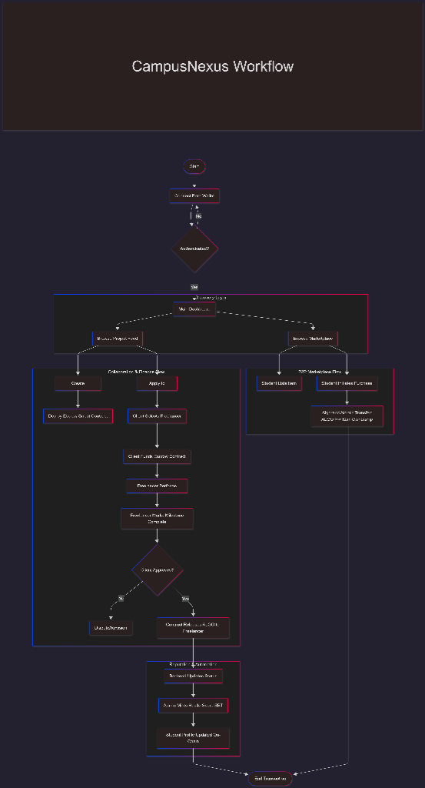

## # 🚀 CampusNexus
### The Decentralized Ecosystem for Student Creators and Commerce

**CampusNexus** is a "Decentralized LinkedIn" and marketplace designed for the modern campus. It connects students through project collaboration and a secure marketplace, all powered by the speed and transparency of the **Algorand Blockchain** and automated by AI.

---

## ✨ Key Features

### 🏦 Track 1: Future of Finance (Blockchain)
- **Milestone-Based Escrow**: Secure peer-to-peer student freelancing. Payments are locked in smart contracts and released only when work is delivered.
- **P2P Marketplace**: Buy and sell used Arduino kits, sensors, and textbooks safely using ALGO.
- **Micro-Equity Tokens**: Team leads can issue ASAs (Algorand Standard Assets) to teammates to represent shares in a project’s future success.

### 🤖 Track 2: AI & Automation
- **AI Skill-Matcher**: A smart backend that matches student profiles with project needs using NLP.
- **Hustle-Score**: A verifiable reputation system. Earn Soulbound Tokens (SBTs) for successful collaborations, verified by AI feedback analysis.
- **Automated Verification**: AI scans marketplace listings to verify item condition and suggest fair pricing.

---

## 🛠️ Tech Stack

| Category | Technology |
|----------|------------|
| **Blockchain** | Algorand (Testnet) |
| **Smart Contracts** | Algorand Python 5.0 (AlgoKit) |
| **Backend** | Python (FastAPI) |
| **Frontend** | React.js + Tailwind CSS |
| **Wallet** | Pera Wallet / Defly |

---

## 🏗️ Architecture



- **Frontend**: React components for the Project Feed, Marketplace, and Profile.
- **Backend API**: FastAPI handles AI matching logic and metadata storage.
- **On-Chain Logic**: Algorand Smart Contracts handle all financial transactions and reputation minting.

---

## 🚀 Getting Started

### Prerequisites
- Python 3.10+
- Node.js & npm
- AlgoKit
- Docker (for LocalNet testing)

### Installation

1. **Clone the repo**
   ```bash
   git clone https://github.com/adityagavane47/CampusNexus.git
   cd campusnexus
   ```

2. **Backend Setup**
   ```bash
   cd backend
   pip install -r requirements.txt
   uvicorn app.main:app --reload
   ```

3. **Frontend Setup**
   ```bash
   cd ../frontend
   npm install
   npm run dev
   ```

4. **Local Blockchain**
   ```bash
   algokit localnet start
   ```

---

## 📜 License
Distributed under the MIT License. See [LICENSE](LICENSE) for more information.

---

##👨‍💻Team Amateur
- **Aditya Gavane** - Backend & Blockchain Architecture 
-
